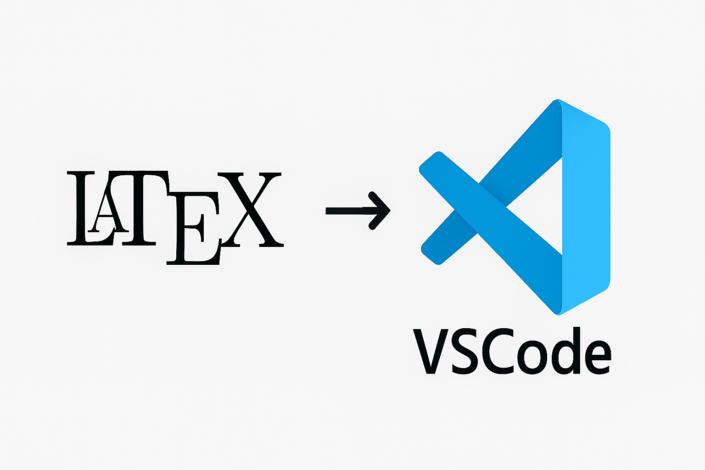

# GUÍA PARA INSTALAR VSCODE COMO ENTORNO LaTeX

---
## Paso 1
Descargar `Texlive` o bien `Miktex`.

Si decides tener `Miktex` como tu distribución de TeX, debes saber que para Windows Debes instalar `Perl`. Puedes instalarlo [aquí](https://strawberryperl.com/). Posteriormente, puedes iniciar la instalación de de [Miktex](https://miktex.org/download).

Es posible que tengas que agregar `Perl` al PATH.

## Paso 2
Instala [VScode](https://code.visualstudio.com/). Justo después, instala la extensión [LaTeX Workshop](https://marketplace.visualstudio.com/items?itemName=James-Yu.latex-workshop).

## Paso 3
Pasemos a configurar un perfil para tener un buen editor LaTeX.

- Descargar la extensión Code Spell Checker (en español o inglés).
- Copiar el archivo [settings.json](/settings.json) en el tuyo original. Puedes encontrarlo `control`+`shift`+`p`, y escribiendo `Preferences: Open User Settings (JSON)`.
